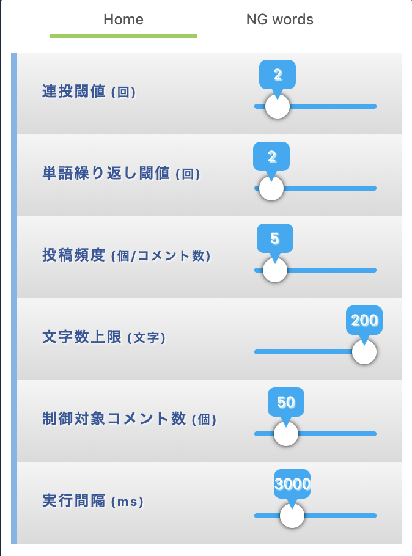
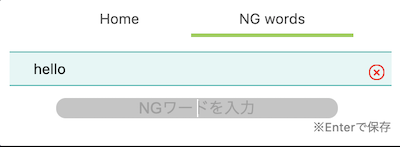
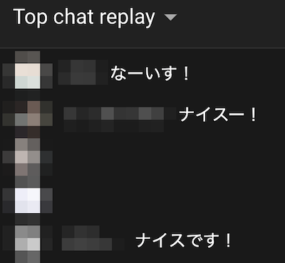

# modekun

[](https://github.com/tjmtmmnk/modekun/actions/workflows/build.yml)

moderate live chat

## Usage
Now, modekun can be used only in Youtube and Mildom, and only Japanese.

- moderate
  - repeat post 
  - repeat word in a chat
  - NG word
  
popup looks like this





chats are hidden automatically



### repeat post 
repeat post threshold (連投閾値) can control how many chats posted by the same user should not be hidden.
  
#### example
```
user A: こんにちは
user A: こんにちは
user A: こんにちは
user B: こんにちは
user B: こんにちは
```
If `repeat post threshold = 3`, chats posted by user A will be hidden. 

### repeat word in a chat
repeat word in a chat (単語繰り返し閾値) can control how many words shown in a chat should not be hidden.

#### example
```
user A: 最強最強最強
user B: こんにちは
```
If `repeat word in a chat = 2`, chats posted by user A will be hidden.

### NG word
```
user A: こんにちは
user A: こん
user B: ハロー
```
If `NG word = こん`, chats posted by user A will be hidden.


---

## Prerequisites

* [node + npm](https://nodejs.org/) (Current Version)

## Setup

```
npm install
```

## Build

```
npm run build
```

## Build in watch mode

### terminal

```
npm run watch
```

## Load extension to chrome

Load `dist` directory

## Test
`npx jest` or `npm run test`
