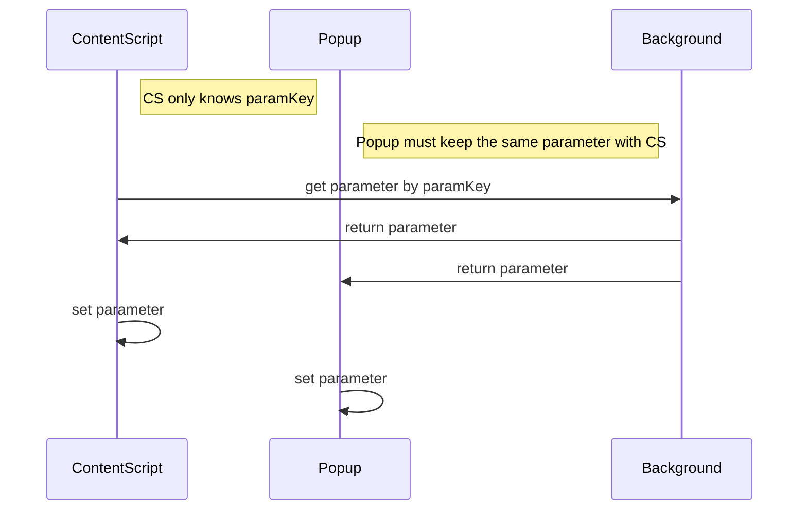
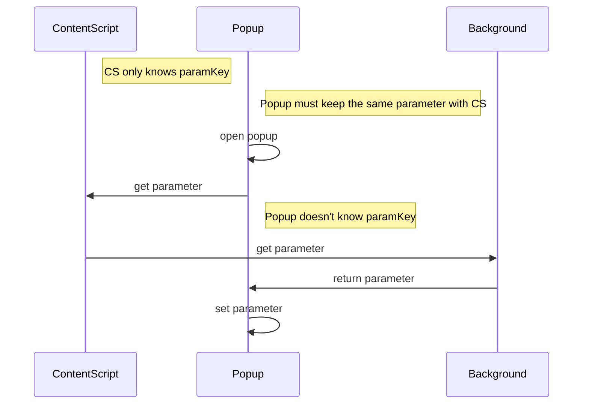
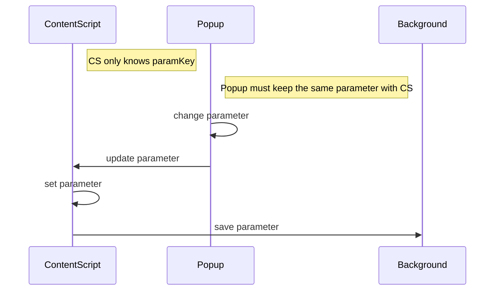

## Begin from ContentScript

```mermaid
sequenceDiagram
    participant ContentScript
    Note right of ContentScript: CS only knows paramKey
    participant Popup
    participant Background
    Note right of Popup: Popup must keep the same parameter with CS
    ContentScript ->> Background: get parameter by paramKey
    Background ->> ContentScript: return parameter
    Background ->> Popup: return parameter
    ContentScript ->> ContentScript: set parameter
    Popup ->> Popup: set parameter
```

## Begin from Popup

```mermaid
sequenceDiagram
    participant ContentScript
    Note right of ContentScript: CS only knows paramKey
    participant Popup
    participant Background
    Note right of Popup: Popup must keep the same parameter with CS
    Popup ->> Popup: open popup
    Popup ->> ContentScript: get parameter
    Note right of Popup: Popup doesn't know paramKey
    ContentScript ->> Background: get parameter
    Background ->> Popup: return parameter
    Popup ->> Popup: set parameter
```

## Change parameter in Popup

```mermaid
sequenceDiagram
    participant ContentScript
    Note right of ContentScript: CS only knows paramKey
    participant Popup
    participant Background
    Note right of Popup: Popup must keep the same parameter with CS
    Popup ->> Popup: change parameter
    Popup ->> ContentScript: update parameter
    ContentScript ->> ContentScript: set parameter
    ContentScript ->> Background: save parameter
```

## Change location in ContentScript

same with _Begin from ContentScript_
